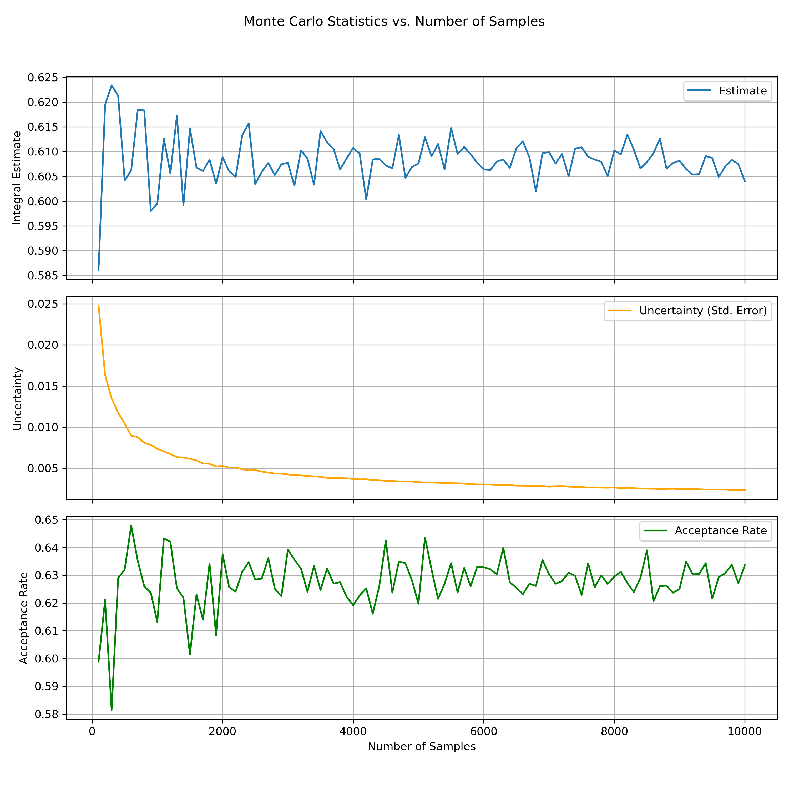
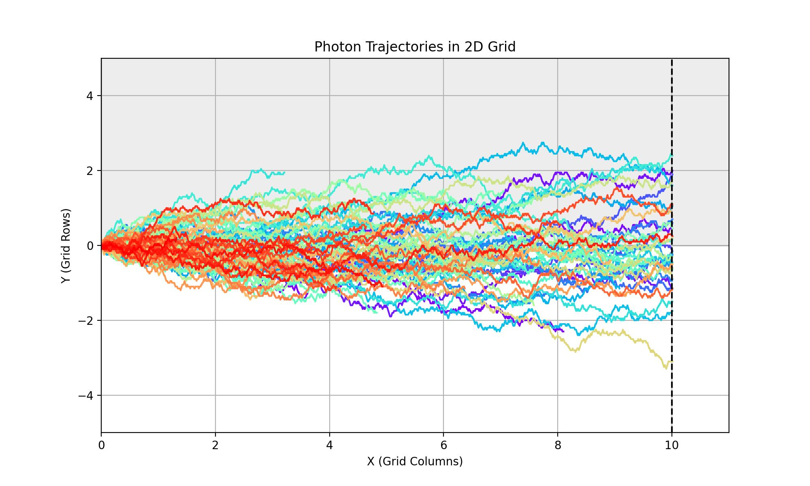

# Monte Carlo Methods: Integration & Photon Simulation

This project explores foundational Monte Carlo methods from radiation physics and computational statistics, with initial implementations focused on:

- **Monte Carlo Integration**: Estimating integrals using random sampling, with convergence analysis over increasing sample sizes.
- **Photon Trajectories in 2D**: Simulating randomized photon movement through a grid, illustrating scattering and absorption boundaries.

Additional modules will be added for variance reduction, rejection sampling, and applications in medical imaging simulations.

## Sample Outputs

### Monte Carlo Estimate Statistics

### Photon Trajectories in 2D Grid
